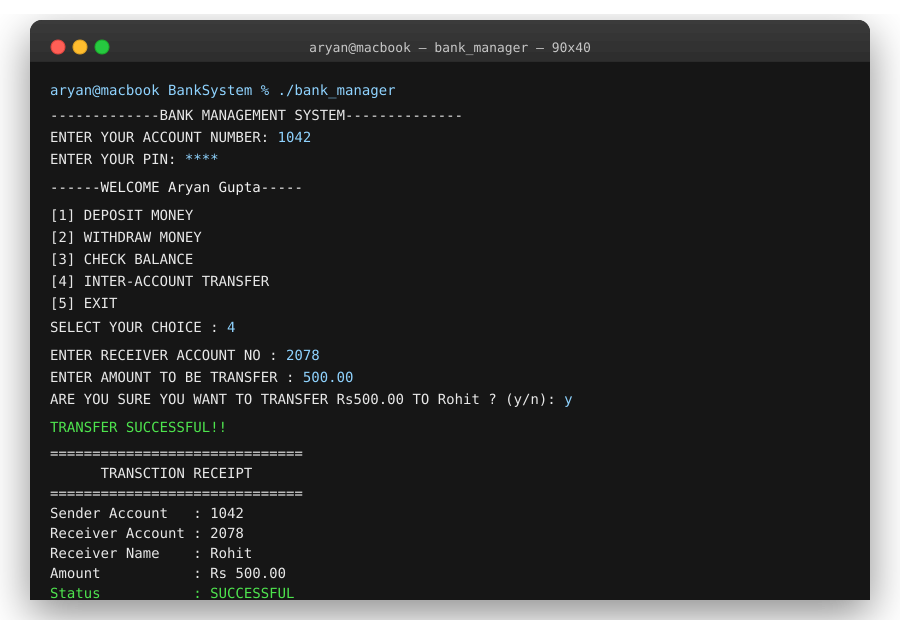
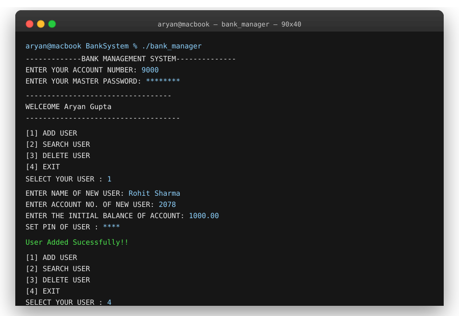

# 🏦 Bank Account Manager

A console-based **Bank Management System** written in C, using file handling (`user.txt`, `manager.txt`, `transactions.txt`) to persist data — no database required. Built as a self-made project to practice structs, file I/O, and modular functions in C.



## ✨ Features

### 👤 Customer
- Login with **Account Number + PIN**
- 💰 Deposit money
- 💸 Withdraw money
- 📊 Check balance
- 🔁 Inter-account money transfer (with sender/receiver validation and y/n confirmation)
- 🧾 Auto-generated transaction receipt (console + saved to `transactions.txt`)

### 🛠️ Manager
- First-run setup: create bank manager profile + master password
- Login with **Manager Account Number + Master Password**
- ➕ Add new user
- 🔍 Search user by account number
- 🗑️ Delete user (with confirmation)



## 📂 File Structure

| File | Purpose |
|---|---|
| `bank_manager.c` | Main source code |
| `manager.txt` | Stores bank manager details (auto-created on first run) |
| `user.txt` | Stores all customer account records |
| `transactions.txt` | Log of all successful transfers/receipts |

## ⚙️ How It Works

- Each customer record (`struct Bank`) stores: name, account number, balance, PIN.
- The manager record (`struct Manager`) stores: name, account number, master password.
- All reads/writes go through helper functions:
  - `finduser()` — looks up an account by number
  - `updatebalance()` — rewrites `user.txt` with an updated balance
  - `deleteuser()` — rewrites `user.txt` excluding the deleted account
  - `interbanktransaction()` — validates and performs a transfer between two accounts
  - `savereceipt()` — prints and logs a transaction receipt

## 🚀 Build & Run

```bash
gcc bank_manager.c -o bank_manager
./bank_manager
```

On the very first run, no `manager.txt` exists yet — the program will prompt you to set up the bank manager (name, account number, master password). After that, the same login screen serves both customers and the manager: entering the manager's account number routes you to the manager menu (after the master password), and any other valid account number routes to the customer menu (after the PIN).

## 🌍 Portability

Yes — the code only uses standard C (`stdio.h`, `string.h`), so it compiles and runs on **Linux, macOS, and Windows** with any standard C compiler (GCC, Clang, MinGW, etc.). No OS-specific libraries are used, and the data files (`user.txt`, `manager.txt`, `transactions.txt`) are created automatically in the same folder wherever you run it — no setup needed on a new machine.

One thing to note: the colored output (`\033[31m`, `\033[32m`, etc.) uses ANSI escape codes. These work out of the box on Linux/macOS terminals and on modern Windows Terminal / PowerShell, but on the old Windows `cmd.exe` you may need to enable ANSI support (or just ignore it — the color codes will print as raw text but the program will still run fine).

## 🧩 Possible Improvements

- Hash the PIN and master password instead of storing them in plain text
- Replace fixed-width file parsing with a more robust format (e.g. CSV with a proper parser, or a lightweight database)
- Add input validation loops (currently a bad `scanf` input can desync the menu)
- Separate customer/manager logic into different `.c`/`.h` files for readability

---
*A project by Aryan Gupta — BCA student, Amity University Online.*
